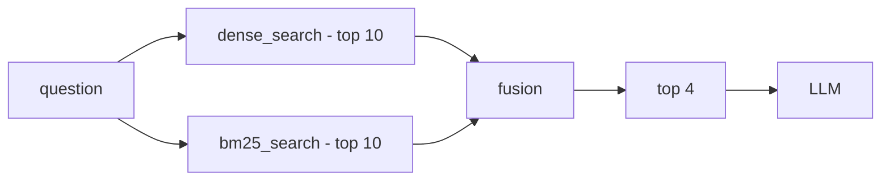
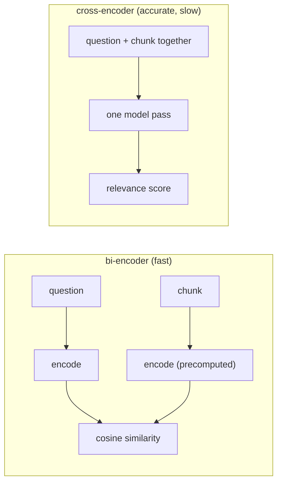
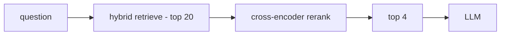

# Project 17 — Hybrid Search · Concepts

Concepts to know before writing code: **Dense + BM25 + Fusion** (with a look ahead at Reranking).

> Companion to `README.md`. This page is concepts only; the implementation steps are in the README.

---

## 01 · The problem to solve

The Project 16 pipeline is 100% **dense search**: the question becomes a vector, and the nearest chunks come back. That failed on one test:

> **Test case 8**
> **Question:** `How much vacation do I get after a production incident?`
> **Document text:** `additional time off in lieu if they are paged outside working hours`
>
> Same meaning, **zero shared vocabulary**. The correct chunk did not come back even at `top_k = 6`.

This is called **vocabulary mismatch**. Chunk size, prompt wording and a bigger `top_k` do not fix it — it is a *retrieval* problem, not a generation problem.


The failure happens at step 3, long before the LLM sees anything.

---

## 02 · Two families of search

The fix is to run a **word-based** search next to the semantic one.

| | Dense (embedding) | Sparse (BM25) |
|---|---|---|
| **Based on** | meaning / vector proximity | exact word match |
| **Representation** | 384 floats (dense) | word counts, mostly zero (sparse) |
| **Strong at** | synonyms, paraphrases | product names, error codes, version numbers, rare terms |
| **Weak at** | rare exact tokens | synonyms, rewritten sentences |
| **Output** | `distance` — lower is better | `score` — higher is better |

**Definition of hybrid search:** run both retrievers *separately*, then *merge* the two result lists. That is all. The hard part is the merge, not the running.



---

## 03 · BM25 at a glance

**BM25** is an improved **TF-IDF**. It gives each chunk one number, built from three factors:

| Factor | Name | Effect on the score |
|---|---|---|
| How often does the word appear in this chunk? | `TF` — term frequency | more → higher |
| How many other chunks contain it? | `IDF` — inverse document frequency | rarer → **much** higher |
| How long is this chunk? | `length normalization` | longer → lower |

**The key thing about IDF:** a word like `team` that appears in every document gets almost zero weight. A word like `incident` that appears in one chunk only gets a very high weight. Exactly what test case 8 needs.

The only new library surface in this project:

```python
from rank_bm25 import BM25Okapi

# build ONCE at startup, never inside the search function
bm25 = BM25Okapi([tokenize(t) for t in chunk_texts])

# per query -> one float for EVERY chunk, in corpus order
scores = bm25.get_scores(tokenize(question))
# NOT sorted · NOT cut to k · NOT normalized
```

**One tokenizer, both sides.** The same function that tokenizes the corpus must tokenize the query. If one lowercases and the other does not, nothing matches — and nothing raises an error.

---

## 04 · The real problem: two different scales

Now there are two lists. Why can't the scores simply be added?

```
Chroma cosine distance    lower is better
0.0 |=====================| 2.0     bounded, inverted

BM25 score                higher is better
0.0 |=====================| ???     unbounded, query-dependent
```

- One is **inverted** (lower is better), the other is not → one of them must be flipped first.
- BM25 has **no upper bound**. A score of 8 is excellent for one query and ordinary for another — it is not comparable across queries.
- A chunk may appear in **only one** list. What value does it get in the other? That is a design decision, not a fact.

---

## 05 · Strategy A — Normalize + weighted sum

Scale both lists into `0..1`, then add them with a weight.

```python
# pseudo-code - not the implementation
for each list:
    norm = (score - min) / (max - min)      # min-max normalization

fused = alpha * dense_norm + (1 - alpha) * sparse_norm
```

**Three traps**

- If every score is equal → `max - min = 0` → division by zero.
- Normalization is done per query, so the best result always becomes `1.0` — even when it is a bad result in absolute terms.
- `alpha` is a hand-picked number. Without a labelled evaluation set, tuning it is guessing.

**Sanity check:** `alpha = 1.0` must reproduce `dense_only` exactly, and `alpha = 0.0` must reproduce `bm25_only` exactly. If it does not, the bug is in the normalization or in the default value given to single-list chunks.

---

## 06 · Strategy B — RRF (Reciprocal Rank Fusion)

The core idea: **throw the scores away and keep only the ranks.** Remove the scores and the scale problem disappears with them.

```
score(chunk) = Σ  1 / (k + rank)        # rank is 1-based, k = 60 by convention
```

### Worked example

| Dense | rank | | BM25 | rank |
|---|---|---|---|---|
| A | 1 | | E | 1 |
| B | 2 | | C | 2 |
| C | 3 | | A | 3 |
| D | 4 | | B | 4 |

| chunk | calculation (k = 60) | RRF score | result |
|---|---|---|---|
| **A** | `1/61 + 1/63` | `0.03226` | 1st — in both lists, high |
| **C** | `1/63 + 1/62` | `0.03200` | 2nd — in both lists, middle |
| **B** | `1/62 + 1/64` | `0.03176` | 3rd — in both lists, low |
| E | `1/61` | `0.01639` | 4th — rank 1, but one list only |
| D | `1/64` | `0.01563` | 5th |

**What this table is telling you:** `E` was rank 1 in BM25 and still **lost** to `B`, which ranked low in both lists. RRF inherently rewards **agreement** between the two retrievers — exactly the behaviour wanted from hybrid search.

### What `k` controls

- **Large k (60)** → gaps between ranks shrink → "being in both lists" matters more than "being first".
- **Small k (1)** → rank 1 dominates → whoever wins one list wins overall.

---

## 07 · Looking ahead — Reranking (Project 18)

The embedding model used so far is a **bi-encoder**: it encodes the question and the chunk *separately* and compares the vectors. It never sees the two together.



Nothing can be precomputed for a cross-encoder — one model run per `(question, chunk)` pair. That makes it impossible over 1000 chunks, so the architecture becomes **two-stage**:



| Stage | Judged on | Meaning |
|---|---|---|
| `retrieve (top 20)` | **recall** | don't lose the right answer — order does not matter |
| `rerank (top 4)` | **precision** | put the best ones on top — order is everything |

**The rule that explains the project order:** if the correct chunk is not in those 20, the reranker can do *nothing*. That is why hybrid (recall) comes first and reranking (precision) comes second.

---

## 08 · The diagnosis on test case 8

After hybrid runs, there are two possible outcomes — and each one decides what the next project has to do:

| Outcome | Diagnosis | Next step |
|---|---|---|
| The chunk is in the list, but ranked below 4 | a **ranking** problem | exactly what a reranker fixes → Project 18 |
| The chunk is in neither list | a **recall** problem | a reranker is useless; needs query rewriting or better chunking |

---

## 09 · Glossary — the keywords

| Keyword | Short meaning |
|---|---|
| `dense retrieval` | search by semantic vector — the Project 16 approach |
| `sparse retrieval` | word-based search — BM25 |
| `BM25` | keyword scoring algorithm: TF + IDF + length normalization |
| `TF` / `IDF` | word frequency in the doc / rarity of the word across the corpus |
| `hybrid search` | run dense and sparse together and merge the results |
| `fusion` | the step that merges two ranked lists |
| `min-max normalization` | rescaling scores into 0..1 so they can be added |
| `RRF` | rank-based fusion: `Σ 1/(k+rank)` |
| `bi-encoder` | question and text encoded separately — fast |
| `cross-encoder` | question and text go into the model together — accurate, slow |
| `reranking` | re-ordering retrieved results with a more accurate model |
| `recall` | was the right answer retrieved at all? |
| `precision` | did the right answer reach the top? |
| `vocabulary mismatch` | same meaning, no shared words — the cause of the test 8 failure |
| `query rewriting` | an LLM rewrites the question into the documents' own vocabulary |

---

### The interview sentence

> "For vocabulary mismatch I use hybrid search: BM25 alongside dense retrieval, merged with RRF, because the two scoring systems are not on a comparable scale. I judge the retrieve stage on recall and the rerank stage on precision."
