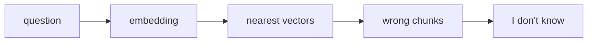
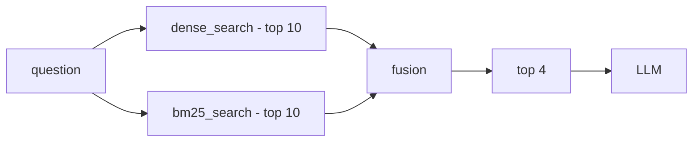
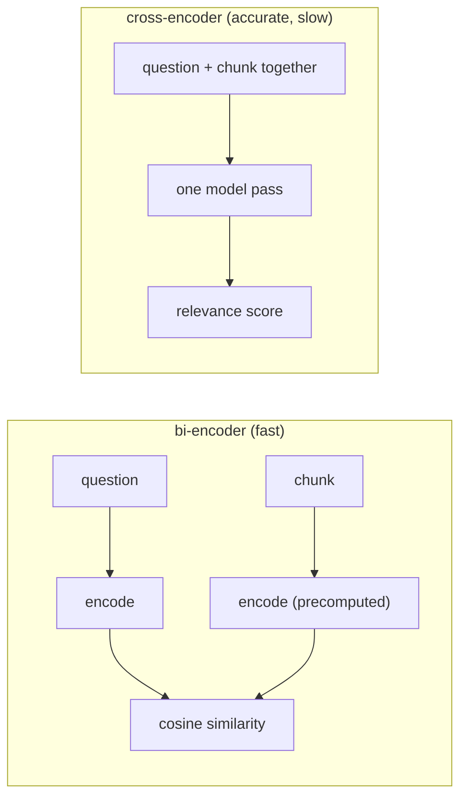
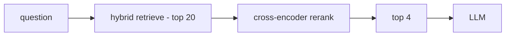

# پروژهٔ ۱۷ — Hybrid Search · مفاهیم

مفاهیم لازم قبل از کد زدن: **Dense + BM25 + Fusion** (و یک نگاه به Reranking).

> مکمل `README.md` — این صفحه فقط مفاهیم است، مراحل پیاده‌سازی در README.

---

## ۰۱ · مسئله‌ای که باید حل شود

پایپ‌لاین پروژهٔ ۱۶ فقط **dense search** دارد: سوال به وکتور تبدیل می‌شود و نزدیک‌ترین chunkها برمی‌گردند. این روش روی یک تست شکست خورد:

> **Test case 8**
> **سوال:** `How much vacation do I get after a production incident?`
> **متن سند:** `additional time off in lieu if they are paged outside working hours`
>
> هر دو یک معنی دارند، ولی **هیچ کلمهٔ مشترکی** ندارند. chunk درست حتی در `top_k = 6` هم برنگشت.

اسم این مشکل **vocabulary mismatch** است. با تغییر chunk size، تغییر prompt یا بالا بردن `top_k` حل نمی‌شود — چون اصلاً یک مشکلِ *retrieval* است، نه یک مشکلِ generation.



شکست در مرحلهٔ ۳ اتفاق می‌افتد، خیلی قبل از اینکه LLM چیزی ببیند.

---

## ۰۲ · دو خانوادهٔ جستجو

راه‌حل این است که در کنار جستجوی معنایی، یک جستجوی **کلمه‌محور** هم اجرا کنیم.

| | Dense (embedding) | Sparse (BM25) |
|---|---|---|
| **پایه** | معنی / نزدیکی بردارها | تطابق دقیق کلمه |
| **نمایش داده** | ۳۸۴ عدد ممیز شناور (چگال) | شمارش کلمات، اکثراً صفر (تُنُک) |
| **قوی در** | مترادف، بازنویسی جمله | نام محصول، کد خطا، شمارهٔ نسخه، اصطلاح نادر |
| **ضعیف در** | کلمهٔ نادر و دقیق | مترادف، جملهٔ بازنویسی‌شده |
| **خروجی** | `distance` — کمتر = بهتر | `score` — بیشتر = بهتر |

**تعریف hybrid search:** هر دو جستجو را *جداگانه* اجرا کن، بعد دو لیست نتیجه را *ادغام* کن. همین. سختیِ کار در قسمت ادغام است، نه در اجرا.



---

## ۰۳ · BM25 در یک نگاه

**BM25** نسخهٔ پیشرفتهٔ **TF-IDF** است. برای هر chunk یک عدد می‌دهد که از سه عامل ساخته می‌شود:

| عامل | اسم | اثر روی امتیاز |
|---|---|---|
| کلمه در این chunk چند بار آمده؟ | `TF` — term frequency | بیشتر ← امتیاز بالاتر |
| این کلمه در چند chunk دیگر هست؟ | `IDF` — inverse document frequency | کمیاب‌تر ← امتیاز **خیلی** بالاتر |
| این chunk چقدر بلند است؟ | `length normalization` | بلندتر ← امتیاز پایین‌تر |

**مهم‌ترین نکتهٔ IDF:** کلمه‌ای مثل `team` که در همهٔ سندها هست، وزنش تقریباً صفر می‌شود. کلمه‌ای مثل `incident` که فقط در یک chunk هست، وزن بسیار بالایی می‌گیرد. دقیقاً همان چیزی که تست ۸ لازم دارد.

تنها API جدید این پروژه:

```python
from rank_bm25 import BM25Okapi

# build ONCE at startup, never inside the search function
bm25 = BM25Okapi([tokenize(t) for t in chunk_texts])

# per query -> one float for EVERY chunk, in corpus order
scores = bm25.get_scores(tokenize(question))
# NOT sorted · NOT cut to k · NOT normalized
```

**tokenize باید یکی باشد.** همان تابعی که corpus را توکنایز می‌کند باید سوال را هم توکنایز کند. اگر یکی lowercase باشد و دیگری نه، هیچ کلمه‌ای match نمی‌شود و هیچ خطایی هم نمی‌گیری.

---

## ۰۴ · مشکل اصلی: دو مقیاس متفاوت

حالا دو لیست داریم. چرا نمی‌شود امتیازها را جمع کرد؟

```
Chroma cosine distance    lower is better
0.0 |=====================| 2.0     bounded, inverted

BM25 score                higher is better
0.0 |=====================| ???     unbounded, query-dependent
```

- یکی **معکوس** است (کمتر بهتر)، دیگری نه ← قبل از هر کاری باید یکی‌شان برعکس شود.
- BM25 **سقف ندارد**. امتیاز ۸ برای یک سوال «عالی» است و برای سوال دیگر «معمولی» — بین دو کوئری قابل مقایسه نیست.
- یک chunk ممکن است فقط در **یکی** از دو لیست باشد. مقدارش در لیست دیگر چیست؟ این یک تصمیم طراحی است، نه یک حقیقت.

---

## ۰۵ · راه اول — Normalize + Weighted Sum

هر دو لیست را به بازهٔ `0..1` ببر، بعد با وزن جمع کن.

```python
# pseudo-code - not the implementation
for each list:
    norm = (score - min) / (max - min)      # min-max normalization

fused = alpha * dense_norm + (1 - alpha) * sparse_norm
```

**سه تله**

- اگر همهٔ امتیازها برابر باشند ← `max - min = 0` ← تقسیم بر صفر.
- normalize روی *همان کوئری* انجام می‌شود، پس بهترین نتیجه همیشه `1.0` می‌گیرد — حتی اگر ذاتاً بد باشد.
- `alpha` یک عدد دستی است. بدون مجموعهٔ تست برچسب‌خورده، تنظیمش حدس زدن است.

**تست سلامت:** `alpha = 1.0` باید دقیقاً همان `dense_only` را بدهد و `alpha = 0.0` دقیقاً `bm25_only` را. اگر نداد، مشکل از normalize یا از مقدار پیش‌فرضِ chunkهای تک‌لیستی است.

---

## ۰۶ · راه دوم — RRF (Reciprocal Rank Fusion)

ایدهٔ اصلی: **امتیازها را کاملاً دور بریز، فقط رتبه را نگه دار.** وقتی امتیاز حذف شود، مسئلهٔ مقیاس هم حذف می‌شود.

```
score(chunk) = Σ  1 / (k + rank)        # rank is 1-based, k = 60 by convention
```

### مثال عددی

| Dense | rank | | BM25 | rank |
|---|---|---|---|---|
| A | 1 | | E | 1 |
| B | 2 | | C | 2 |
| C | 3 | | A | 3 |
| D | 4 | | B | 4 |

| chunk | calculation (k = 60) | RRF score | نتیجه |
|---|---|---|---|
| **A** | `1/61 + 1/63` | `0.03226` | ۱ — در هر دو لیست، بالا |
| **C** | `1/63 + 1/62` | `0.03200` | ۲ — در هر دو لیست، وسط |
| **B** | `1/62 + 1/64` | `0.03176` | ۳ — در هر دو لیست، پایین |
| E | `1/61` | `0.01639` | ۴ — رتبهٔ ۱ ولی فقط یک لیست |
| D | `1/64` | `0.01563` | ۵ |

**پیام این جدول:** `E` رتبهٔ ۱ در BM25 بود، ولی از `B` که در هر دو لیست رتبهٔ پایین داشت **عقب افتاد**. RRF ذاتاً به **agreement** بین دو retriever پاداش می‌دهد؛ همان رفتاری که در hybrid search می‌خواهیم.

### نقش `k`

- **k بزرگ (۶۰)** ← فاصلهٔ بین رتبه‌ها کم می‌شود ← «در هر دو لیست بودن» مهم‌تر از «اول بودن» است.
- **k کوچک (۱)** ← رتبهٔ ۱ خیلی سنگین می‌شود ← عملاً برندهٔ یک لیست همه چیز را می‌برد.

---

## ۰۷ · نگاهی جلوتر — Reranking (پروژهٔ ۱۸)

مدل embedding که تا الان استفاده کرده‌ای یک **bi-encoder** است: سوال و chunk را *جدا جدا* به وکتور تبدیل می‌کند و بعد مقایسه می‌کند. مدل هرگز آن دو را کنار هم ندیده.



برای cross-encoder هیچ چیزی را نمی‌شود از قبل حساب کرد — برای هر جفت `(question, chunk)` یک بار مدل اجرا می‌شود. پس روی ۱۰۰۰ chunk غیرممکن است و معماری **دو مرحله‌ای** می‌شود:



| مرحله | معیار | یعنی چه |
|---|---|---|
| `retrieve (top 20)` | **recall** | جواب درست را از قلم ننداز — ترتیبش مهم نیست |
| `rerank (top 4)` | **precision** | بهترین‌ها را بالا بیاور — ترتیب همه‌چیز است |

**قانونی که ترتیب پروژه‌ها را توضیح می‌دهد:** اگر chunk درست اصلاً در آن ۲۰ تا نباشد، reranker *هیچ کاری* نمی‌تواند بکند. برای همین اول hybrid (بهبود recall) و بعد rerank (بهبود precision).

---

## ۰۸ · تشخیص نهایی روی تست ۸

بعد از اجرای hybrid، دو حالت ممکن است — و هرکدام پروژهٔ بعدی را تعیین می‌کند:

| نتیجه | تشخیص | قدم بعدی |
|---|---|---|
| chunk درست در لیست هست ولی رتبه‌اش پایین‌تر از ۴ است | یک مشکل **ranking** | دقیقاً چیزی که reranker حل می‌کند ← پروژهٔ ۱۸ |
| chunk درست در هیچ‌کدام از دو لیست نیست | یک مشکل **recall** | reranker بی‌فایده است؛ باید سراغ query rewriting یا chunking بهتر بروی |

---

## ۰۹ · واژه‌نامه — کلمات کلیدی

| Keyword | معنی کوتاه |
|---|---|
| `dense retrieval` | جستجو با بردار معنایی — روش پروژهٔ ۱۶ |
| `sparse retrieval` | جستجوی کلمه‌محور — BM25 |
| `BM25` | الگوریتم امتیازدهی کلمه‌محور: TF + IDF + length normalization |
| `TF` / `IDF` | تکرار کلمه در سند / کمیاب بودن کلمه در کل مجموعه |
| `hybrid search` | اجرای dense و sparse با هم و ادغام نتایج |
| `fusion` | مرحلهٔ ادغام دو لیست رتبه‌بندی‌شده |
| `min-max normalization` | بردن امتیازها به بازهٔ ۰ تا ۱ برای قابل جمع شدن |
| `RRF` | ادغام بر پایهٔ رتبه: `Σ 1/(k+rank)` |
| `bi-encoder` | سوال و متن جداگانه encode می‌شوند — سریع |
| `cross-encoder` | سوال و متن با هم وارد مدل می‌شوند — دقیق، کند |
| `reranking` | مرتب‌سازی دوبارهٔ نتایج بازیابی‌شده با مدل دقیق‌تر |
| `recall` | آیا جواب درست اصلاً بازیابی شد؟ |
| `precision` | آیا جواب درست بالای لیست آمد؟ |
| `vocabulary mismatch` | هم‌معنی بودن بدون کلمهٔ مشترک — علت شکست تست ۸ |
| `query rewriting` | بازنویسی سوال با LLM به واژگان خود سندها |

---

### جملهٔ مصاحبه‌ای

> «برای vocabulary mismatch از hybrid search استفاده می‌کنم: BM25 در کنار dense retrieval، و ادغام با RRF چون امتیازهای دو سیستم قابل جمع نیستند. مرحلهٔ retrieve را بر اساس recall می‌سنجم و مرحلهٔ rerank را بر اساس precision.»
